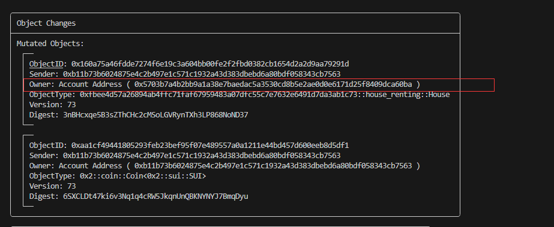

# House Renting Platform

## 1 Entity Definition

- House Renting Platform (`RentalPlatform`)
- Rental Notice (`RentalNotice`)
- House (`House`)
- Lease (`Lease`)
- Inspection Report(`Inspection`)
- Platform Administrator(`Admin`)
- Landlord
- Tenant

## 2 Entity Relationship

- Any user can create a rental platform（`RentalPlatform`） and become the platform administrator(`Admin`)
- Landlord posts a rental notice(`RentalNotice`)
- Tenant pays rent and deposit, and sign rental contracts(`Lease`).The rent is transferred to the landlord, and the deposit is temporarily managed by the platform 
- The landlord hands over the house(`House`) to the tenant
- Rent expires, Landlord inspects house and submits inspection report(`Inspection`)
- The platform administrator reviews the inspection report and determines the level of damage to the house. If there is any damage, a portion of the deposit will be compensated to the landlord
- Tenant collect the remaining deposit and return the property to the landlord

## 3 API Definition

- **new_platform_and_transfer**: create a new rental platform object, become a platform administrator
- **post_rental_notice_and_transfer**:  The landlord releases a rental message, creates a house object  which belong to himself
- **pay_rent_and_transfer**: Tenants pay rent and sign rental contracts
- **transfer_house_to_tenant**: After the tenant pays the rent, the landlord transfers the house to the tenant
- **landlord_inspect**:Rent expires, landlord inspects house and submits inspection report
- **review_inspection_report**: The platform administrator reviews the inspection report and determines the level of damage to the house.
- **tenant_return_house_and_transfer**: Tenant collect the remaining deposit and return the property to the landlord

## 4 Testing

### 4.1 publish contract

> switch to Admin account

- **run command**

```bash
$ sui client publish --gas-budget 100000000
```

- **important outputs**


- **record packageID**
```bash
export PACKAGE_ID=0xfbee4d57a26894ab4ffc71faf67959483a07dfc55c7e7632e6491d7da3ab1c73
export GAS_BUDGET=100000000
export MODULE_NAME="house_renting"
```

### 4.2 new_platform_and_transfer

- **run command**

```bash
sui client call --package $PACKAGE_ID --module $MODULE_NAME --function new_platform_and_transfer --gas-budget $GAS_BUDGET

```
- **important outputs**


- **record retal platform and admin objecID**

```bash
export PLATFORM_ID=0xb59c401873a2ed5ab234d9e9a5f5e0b70aa9a3ac4726ce4688d11506847534a8
export ADMIN_ID=0xec560bcaf2cf1f8edc9b0b56df8cfb6050523dd6d0e3a55d09faf3d11d9e0358
```

### 4.3 post_rental_notice_and_transfer

#### （1）Landlord post a rental notice

> The landlord posted a rental information for 2000 GAS

- **run command**

```bash
# switch to landlord account
sui client switch --address landlord
# call post_rental_notice_and_transfer
sui client call --package $PACKAGE_ID --module $MODULE_NAME --function post_rental_notice_and_transfer --args $PLATFORM_ID 2000 70 "his house is very beautiful, facing north and south, with ample sunshine and convenient transportation" "https%3A%2F%2Ftse3-mm.cn.bing.net%2Fth%2Fid%2FOIP-C.NUiYPf7aMFhP-ZCEF0C3IgHaEo%3Fw%3D309%26h%3D193%26c%3D7%26r%3D0%26o%3D5%26pid%3D1.7" --gas-budget $GAS_BUDGET
```

- **important outputs**


- **record rental notice and house objecID**
  
  ```bash
  export HOUSE_ID=0x160a75a46fdde7274f6e19c3a604bb00fe2f2fbd0382cb1654d2a2d9aa79291d
  export NOTICE_ID=0x18ac421969fddeaf1ffff1040a972500ce9640184f2e476e77e77524b0367e65
#### （2）display rental platform object detail

```bash
$ sui client object $PLATFORM_ID --json
```

- notices

  ```json
  "notices": {
          "type": "0x2::table::Table<0x2::object::ID, 0xfbee4d57a26894ab4ffc71faf67959483a07dfc55c7e7632e6491d7da3ab1c73::house_renting::RentalNotice>",
          "fields": {
            "id": {
              "id": "0xb1c9deb697a18e3a3b31ed43d9e65de179cac4d1b1428b6c211ec12dfb2c8103"
            },
            "size": "1"
          }
        },
        "owner": "0x5703b7a4b2bb9a1a38e7baedac5a3530cd8b5e2ae0d0e6171d25f8409dca60ba"
      }
  ```

  

### 4.4 pay_rent_and_transfer

> The tenant applies to rent a house for one month and pays 3000 yuan, of which 2000 yuan is the rent and 1000 yuan is the deposit.

- **run command**

```bash
#switch ato tenant account
sui client switch --address tenant
# split a coin to pay
sui client split-coin --coin-id 0x44d9b7969ef80339a90eab91eb5a9a4abfa6536dc0f53adec8803e4ead34151c --amounts 3000  --gas-budget 100000000 --gas 0xdbc0212e4aeb1abf9ac75ed326a2fab0083ca853ec0adfa84ae0fbd84f4c96d2
# set global variables
export PAY_COIN=0x0e094b5f164f572da2d0d00e1194e4bb351288dde28203de752de449f295720c
# call pay_rent_and_transfer
sui client call --package $PACKAGE_ID --module $MODULE_NAME --function pay_rent_and_transfer --args $PLATFORM_ID $HOUSE_ID 1 $PAY_COIN --gas-budget $GAS_BUDGET
```

- **important outputs**


- **record lease objectID**

  ```bash
  export LEASE_ID=0xd53c66392451a98d2f3b8535446cd2153138ca440fb287a1f7b7a049bb4ee845
  ```

- **display landlord's GAS**

  >The landlord's account received two thousand GAS

  ```bash
  sui client switch --address landlord
  sui client gas
  ```

  

- **display rental platform object**

  >rental notice deleted and platform account received a deposit of 1000 GAS

  ```bash
  sui client object $PLATFORM_ID
  ```

  

### 5.5 transfer_house_to_tenant

> After the tenant pays the rent, the landlord transfers the house to the tenant

- **run command**

```bash
#switch to landlord account
sui client switch --address landlord
# call transfer_house_to_tenant
sui client call --package $PACKAGE_ID --module $MODULE_NAME --function transfer_house_to_tenant --args $LEASE_ID $HOUSE_ID  --gas-budget $GAS_BUDGET
```

- **important outputs**

  >Now the house object belongs to tenant



### 5.6 landlord_inspect

> After the rent expires, the landlord will come to inspect the house and submit an inspection report.In the report, the landlord mentioned slight damage to the house

- **run command**

```bash
# call landlord_inspect
sui client call --package $PACKAGE_ID --module $MODULE_NAME --function landlord_inspect --args $LEASE_ID 2 "The house is slightly damaged and requires a 10% deposit compensation" "https%3A%2F%2Ftse1-mm.cn.bing.net%2Fth%2Fid%2FOIP-C.fMDb-yleUONKRzYptYDp-QHaFT%3Fw%3D257%26h%3D184%26c%3D7%26r%3D0%26o%3D5%26pid%3D1.7" --gas-budget $GAS_BUDGET
```

- **important outputs**

  

- **record respection object id**

  ```bash
  export INSPECTION_ID=0x41bb0ee9b929df9a88e0aede978f47eb0cbded8294dcf159c4911e81ba910c0e
  ```

### 5.7 review_inspection_report

> switch to admin account, The paltform administrator agrees with the landlord's assessment of slightly damages and compensate the landlord with 10% of the deposit(100 GAS)

- **run command**

```bash
#switch to admin account
sui client switch --address admin
# call review_inspection_report
sui client call --package $PACKAGE_ID --module $MODULE_NAME --function review_inspection_report --args $PLATFORM_ID $LEASE_ID $INSPECTION_ID 2 $ADMIN_ID --gas-budget $GAS_BUDGET
```

- **important outputs**

  

- **dispaly inspection obeject**

  >The status of the house inspection report has changed to reviewed

  

- **balance changes**

  >The landlord received 100 GAS

  

### 5.8 tenant_return_house_and_transfer

>The tenant returns the room to the landlord , receives the deposit

- **run command**

  ```bash
  #switch to tenant account
  sui client switch --address tenant
  #call transfer_house_to_tenant
  sui client call --package $PACKAGE_ID --module $MODULE_NAME --function tenant_return_house_and_transfer --args $LEASE_ID $HOUSE_ID --gas-budget $GAS_BUDGET
  ```

- **important outputs**

  >After calling the transfer_house_to-tenant method, the house object belongs to the landlord and the tenant collects a deposit of 900 GAS


- **display tenant's GAS**

  >The tenant's balance has increased by 900 GAS

  ```bash
  sui client gas
  ```

  

  

- **display the rental platform**

  >The deposit_pool field on the rental platform has been cleared

  ```bash
  sui client object $PLATFORM_ID --json
  ```


